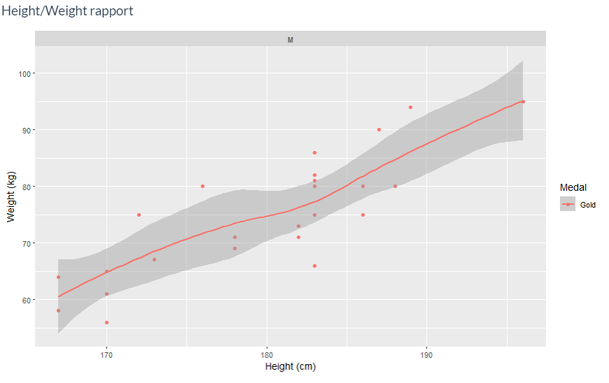

# Dashboard : 120 ans de Jeux Olympiques

Binôme du projet :<br/>
- François Meunier
- Jules Chevenet

## Table des matières

- [Introduction](#introduction)
- [Guide utilisateur](#guide-utilisateur)
- [Guide développeur](#guide-développeur)
- [Rapport](#rapport)
- [Sources](#sources)

## Introduction

Les premiers **Jeux olympiques modernes** se déroulent en 1896 à Athènes et l'instauration des Jeux olympiques d'hiver date de 1924 à Chamonix. Jusqu’à 1992, JO d’été et d’hiver avaient lieu la même année, une fois tous les 4 ans. Depuis, ils sont organisés avec 2 ans d’intervalle.
Une base de données contenant tous les athlètes depuis la création des jeux est donc une mine d'or d'informations.<br/>
Il est intéressant de se demander quels sont les profils de chaque athlète en fonction du sport qu'il pratique, quels sont ceux qui ont gagné le plus de médailles ou bien encore les pays les plus victorieux.<br/>
Nous nous sommes donc proposé de permettre l'élaboration d'un tableau de bord pour **chaque sport** afin d'en extraire les disparités et les similitudes.

## Guide utilisateur

### Lancement du dahsboard

Dans un premier temps, il est nécessaire de télécharger les documents du dépôt git, ou bien de le cloner. Ensuite ouvrir avec RStudio les documents 
ui.R et server.R et se positionner dans le dossier App-1.

 &nbsp;         
    


 &nbsp;         
    


On installe les packages nécessaires avec la commandes suivante :
```
install.packages(c("shiny", "plyr", "ggplot2", "dplyr",
                   "questionr", "shinythemes", "gapminder",
                   "tmap", "rnaturalearth", "rnaturalearthdata",
                   "sf", "rgeos", "DT", "ggrepel", "forcats", "scales"))
```
N.B. : celle-ci figure, en commentaire, au début de ui.R

Ensuite il reste à cliquer sur **"Run App"** en haut à droite dans RStudio. Comme illusté ici :

 &nbsp;         
    


Le dashboard met ensuite quelques secondes à se lancer.<br/>
<br/>
L'adresse url peut être récupérée dans le terminal de RStudio, celle ci commence par "http://127.0.0.1:" et le port varie en fonction de la machine qui lance l'application.

### Alternative

On peut accéder au dashboard à l'adresse suivante : https://rdashboardesiee.shinyapps.io/app-1/<br/>
Cela grâce à shinyapps.io.

### Utilisation

Le dashboard est destiné à tracer des graphiques concernant un sport en particulier, on peut le choisir, et donc pouvoir ensuite comparer les données de plusieurs sports.<br/>
Dans l'onglet "Data Selection" on choisit 'Sport' ou 'Event', si l'on veut un sport ou bien une discipline en particulier.<br/>
Il est possible de taper au clavier le sport dans le menu déroulant 'Element'.<br/>
Après la sélection faite, en allant dans l'onglet "Sport Statistics" on accède aux informations du dashboard (quelques secondes sont nécessaires afin de charger les graphes).

 &nbsp;         
    


Il est possible de **sélectionner l'ensemble des sports** avec 'all', afin d'avoir les statistiques globales (sur toute la base de donnée).

## Guide développeur

#### Base de données

Nous avons utilisé 3 bases de données au format .csv pour réaliser la base de données finale (nommée ‘final’).<br/>
La première base de données est ‘bdd_JO_120_years.csv’, celle-ci a été récupérée sur Kaggle (cf. source en bas du Readme), de même pour ‘noc_regions.csv’. Nous l’avons modifiée afin de pouvoir la combiner avec la première base de données.<br/>
Afin de respecter au mieux les contextes géopolitiques des différentes époques, chaque ville est affiliée à un NOC (ex : Sarajevo = YUG) et non à un pays. Cela afin de pouvoir mettre en place une variable ‘host’ temporellement vraie.
Le seul problème auquel on peut être confronté est le suivant : le NOC ‘YUG’ est désormais (en 2020) associé à la Serbie, par extension une mauvaise recherche sur la base de donnée pourrait associer Sarajevo à la serbie (c’est une ville bosnienne).<br/>
Enfin, nous avons créé la dernière base de données ‘ville_noc.csv’ qui nous a permis d’associer à une ville un NOC, ce afin de pouvoir ajouter une colonne à la base de données finale permettant de savoir si l’athlète était à domicile ou non (en comparant le NOC de la ville qui accueille avec le NOC du joueur).<br/>
Ces jointures figurent dans la partie ‘Data Processing’ du fichier ui.R.

#### Fonctions

Le fichier **‘global.R’** contient toutes les fonctions nécessaires pour le tableau de bord.<br/>
On distingue plusieurs types de fonctions :

- les fonctions qui agissent sur les bases de données et renvoient une base de données, que l’on appellera désormais fonction **“modif”**.
- les fonctions qui agissent sur les bases de données et renvoient des élément à afficher dans le tableau de bord. Qu’on appellera désormais fonction **“affiche”**.

Voici la liste des fonctions utilisées :

**df_subset(col, key, bdd = final)** “modif”<br/>
> Cette fonction renvoie une sous base de données en fonction de la colonne choisie et de la clé définie. Par exemple df_subset(‘Sport’, ‘Judo’) retourne une sous base de donnée ou il y a exclusivement les sportifs dont le sport est le judo.

**df_rank_medal(bdd)** “modif”<br/>
> Cette fonction renvoie une sous base de donnée composé d’une colonne Pays (tous les pays de bdd), une colonne Gold, une colonne Silver, une colonne Bronze et une colonne score. Chaque pays est associé au nombre de médaille d’or, d’argent et de bronze qu’il a gagné dans bdd. Un score est calculé selon la formule suivante : 

 &nbsp;         
    


> Les valeurs égale à -Inf sont remplacées par 0.<br/>
> Cette fonction renvoie une base de données de type “score”.

**df_name_medal(bdd)** “modif”<br/>
> Cette fonction renvoie un dataframe similaire à celui de df_rank_medal() à l'exception près que la première colonne est composé des noms de chaque sportifs à la place des noms de chaque pays. De plus les colonnes nationalité et sexe sont crées. Cette fonction renvoie une base de données de type “score”.

**df_best3(bdd)** “modif”<br/>
> Cette fonction prend une base de données de type “score” et renvoie un data frame correspondant aux 3 meilleurs score de bdd.

**map_f(bdd, key)** “affiche”<br/>
> ‘bdd’ est la base de donnée sélectionnée (le sport) et ‘key’ sera les valeures qui permettent de remplir la carte choroplèthe (dans notre cas le score, mais on peut décider d’afficher autre chose).<br/>
> Cette fonction utilise un data frame ‘world’ issu du package ‘rnaturalearth’, contenant les pays du monde, permettant ainsi de les afficher sur la carte.
> On renomme les pays qui ont un nom différent de celui de la base de donnée ‘final’, afin d’avoir tous les pays. On supprime l’Antarctique, qui ne nous servira évidemment pas.<br/>
> Cette fonction utilise un autre data frame afin d’afficher le nom des 3 meilleurs pays (ceux qui ont le score le plus élevé) : ‘map_best’. 
> ‘map_best’ est issu d’une fusion de la base de donnée world avec bdd et world, puis on sélectionne les 3 premiers pays.<br/>
> La carte est affichée avec ‘tmap()’, qui permet de tracer une carte intéractive.

**piechart_home(bdd)** “affiche”<br/>
> Cette fonction renvoie un graphique camembert avec le pourcentage d’athlètes qui sont à domicile pour le sport sélectionné (bdd).
> Pour ce faire on fait le calcul de pourcentage et on crée un data frame ‘home_df’ le contenant, qui servira à remplir le graphique.

**piechart_medal(bdd)** “affiche”<br/>
> Cette fonction renvoie un graphique camembert avec le pourcentage de médailles obtenues par les joueurs à domicile.
> Pour ce faire on fait le calcul de pourcentage pour chaque médaille sur les joueurs à domicile et on crée un data frame ‘medal_count’ qui servira à remplir le graphique.

**graph_(bdd, choice)** “affiche<br/>
> Cette fonction renvoie un graphique du Poids en fonction de la Taille des éléments de la base de données. La variable ‘choice’ permet de faire un choix d’affichage, ici, un widget donne une valeur entre 1 et 3. ‘choice = 1’ permet de sélectionner uniquement les médaillés d’or, ‘choice = 2’ tous les médaillés et ‘choice = 3’ sélectionne tous les athlètes.

**df_repart(bdd, choice)** “affiche”<br/>
> Cette fonction renvoie un barre graphe du nombre de participant par année. De la même manière que précédemment, la variable ‘choice’ permet de choisir Homme (si égale à “1”), Femme (si égale à “2”) ou tout confondu (si égale à c(“1”,”2”)).

**df_histogramme(bdd_score, zero = TRUE)** “affiche”<br/>
> Cette fonction renvoie un histogramme de la répartition des scores de chaque pays. Elle prend en entrée une base de données de type “score” et un booléen. Si ‘zero = TRUE’, les pays avec un score égale à 0 sont masqué.

### Le dashboard

Le dashboard utilise la librairie Shiny, développée pour les application Web codée en R.<br/>
Le front-end de l’application se situe dans le fichier **ui.R** :<br/>
Nous avons utilisé le thème ‘Flatly’, et implémenté une barre de navigation.<br/>
navbarPage() est constituée de 3 tabPanel() qui sont respectivement : la sélection du sport et l’affichage des graphiques et menu informations.
La sélection du sport/discipline à observer s’effectue à l’aide de 2 liste déroulantes. La première permet de choisir entre Sport et Event et la seconde permet de choisir l’élément d’observation.
Pour l’affichage des graphiques, 3 fluidRow() sont utilisées. Chacun de ces graphes sont dans un wellPanel(), permettant de bien les séparer et de rendre un affichage clair, ce qui est primordial.<br/>
Pour une question d’uniformité et de style, les titres des graphiques ont été ajoutés dans l’ui en html, avec les balises R h5(). Ceci n’est pas dérangeant puisqu’ils ne changent pas en fonction du sport.
Certain widget ont été utilisé afin de rendre les graphiques dynamiques. Enfin, les graphiques sont des input.<br/>
<br/>
Le back-end se situe dans le fichier **server.R** :<br/>
Toutes les output correspondent évidemment à une input de l’ui. Celles-ci sont  :<br/>
- **renderTmap()** pour la carte
- **renderPlot()** pour l’histogramme, les diagrammes barres et les diagrammes camemberts.
- **renderDT()** pour le tableau des 3 meilleurs athlètes.<br/>
Le fichier serveur.R utilise directement les fonctions du fichier global.R afin de créer les output.<br/>
<br/>
La fonction observe() est utilisé pour observer en permanence l’entré de la première liste déroulante du menu de sélection afin d’afficher en temps direct les éléments de la seconde liste déroulante.

#### Ajouter un élément au dashboard

Pour ajouter un élément au dashboard, il faut écrire une fonction de type “affiche” dans le fichier global.R, ajouter une output correspondante à la sortie de la fonction dans le fichier ui.R et lier la sortie à la fonction dans le fichier server.R.<br/>
On peut alors imaginer la possibilité d’afficher de nouveau type de dashboard : premièrement ajouter un nouveau élément de sélection (Exemple : ‘Region’), puis créer des fonctions permettant d’afficher des éléments pertinent (Exemple : bargraphe du Nombre de médaille d’or) afin de faire évoluer le projet).

## Rapport

#### Introduction

Dans ce rapport, nous allons exposer udes exemples pour chacun des éléments du dashboard afin de discuter de la pertinence ou non des éléments choisit.

#### Interprétation

De manière générale, les données renvoyées sont pertinentes.<br/>
Cependant, certains sports comme le jeu de Paume n’ont eu qu’une **seule apparition aux Jeux olympiques**, les trois meilleurs sont alors les trois médaillés.

 &nbsp;         
    


 &nbsp;         
    


Pour certains sports n’ayant eu lieu que de 1896 à 1950 environ on observe sur la carte que les pays Africains n’ont pas participé, mis à part l’Afrique du sud. Cela rend compte du **clivage** existant à cette époque.<br/>
Voici l’exemple avec ‘art competition’ :

 &nbsp;         
    


 &nbsp;         
    


Pour la plupart des sports on se rend compte que quand la proportion d'athlètes à domicile est élevée, le nombre de médailles ne l’est pas. On relève que pour la boxe par exemple le pourcentage de médailles pour les joueur à domicile est impressionnant alors qu’ils n’y en a **que 5%**.

 &nbsp;         
    


 &nbsp;         
    


Il est intéressant de se demander si pour un sport on peut connaître le physique le plus avantageux à avoir, pour être le meilleur.<br/>
On voit que pour certains sport tel que le **curling** il est impossible de déterminer un profil type :

 &nbsp;         
    


Par contre dans un sport comme le **100m homme**, il y a clairement un **profil** définit comme le montre le graphique suivant :

 &nbsp;         
    


 &nbsp;         
    


La moyenne des médaillés d’or se situe entre 60 et 90 kilos et le rapport poids/taille évolue linéairement.<br/>
<br/>
Le graphique concernant la proportions d’hommes et de femmes en fonction des années est révélateur, pour le basket par exemple il y a aujourd’hui autant de joueurs qu’en 1950 mais presque la moitié sont des femmes.

 &nbsp;         
    


**L’histogramme de répartition des pays** est intéressant du fait de son option permettant de cacher les pays n’ayant rien gagné. Par exemple, l’histogramme de la boxe est totalement biaisé lorsque l’option n’est pas cochée :

 &nbsp;         
    


 &nbsp;         
    


Il y a cependant certaines **exceptions**, comme le **tir à la corde** où l'histogramme reste semblable du fait que le sport n’a pas été souvent représenté aux Jeux Olympiques et n'a regroupé qu’un faible nombre de pays participant.

 &nbsp;         
    


 &nbsp;         
    


#### Conclusion

Les dashboards créés sont plutôt pertinents et permettent de dresser nombreuses conclusions sur les différents sports et disciplines des Jeux Olympiques. Le sport est l’un des domaines où les résultats sont les plus durs à prédire et ce projet permet de tirer quelques conclusion sur certains facteurs (physique, le fait d’évoluer à domicile…).<br/> 
La base de données utilisée est très riche, elle n’est pas exploitée à son maximum dans ce projet, mais des pistes d’amélioration sont envisageables (comme mentionné dans le Guide développeur).<br/>
Ce projet nous a permis d’apprendre le R avec une motivation importante et nous somme satisfait du résultat final.<br/>
<br/>
François Meunier et Jules Chevenet.


## Sources

Bases de donnée JO & Base de données NOC/Region : https://www.kaggle.com/heesoo37/120-years-of-olympic-history-athletes-and-results
